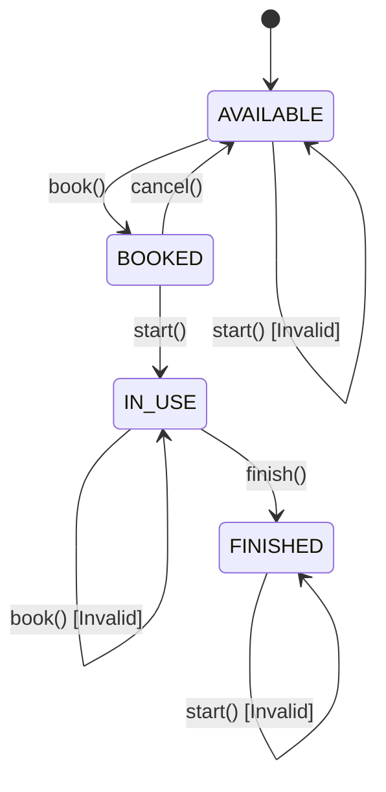

# Blackbox Testing

Implementation of Black Box Testing methods for a Room Booking System case study.

---

# Overview

This project was developed as part of the Software Testing course assignment.  
The implementation focuses on several Black Box Testing techniques used to validate system behavior without examining internal source code structure.

The system being tested is a university discussion room booking system.

---

# Testing Methods

This project implements:

- Equivalence Partitioning (EP)
- Boundary Value Analysis (BVA)
- Decision Table Testing
- State Transition Testing

---

# Study Case

## Room Booking System

The system allows university students to borrow discussion rooms.

### Functional Requirements

### FR-01 — Duration Validation
- Booking duration must be between 1–4 hours
- Values outside the range are rejected

### FR-02 — Booking Rules
Students can book a room only if:
1. Registered student
2. No violations
3. Room available

### FR-03 — Room State Transition
- Rooms can only be booked when AVAILABLE
- Invalid state transitions are not allowed

---

# Project Structure

```bash
blackbox-testing/
│
├── main.py
├── README.md
│
├── screenshots/
│   └── output.png
│
└── report/
    └── Q1-NIM.pdf
```

---

# Equivalence Partitioning (EP)

## Input Domain

| Input | Valid Range |
|---|---|
| Duration | 1–4 hours |

---

## Equivalence Classes

### Valid Class

| Code | Range |
|---|---|
| V1 | 1–4 |

### Invalid Class

| Code | Range |
|---|---|
| I1 | <1 |
| I2 | >4 |

---

# Boundary Value Analysis (BVA)

Boundary testing focuses on values around the minimum and maximum limits.

## Boundary Values

### Minimum Boundary = 1
Test values:
- 0
- 1
- 2

### Maximum Boundary = 4
Test values:
- 3
- 4
- 5

---

# Decision Table Testing

## Causes

| Code | Cause |
|---|---|
| C1 | Student registered |
| C2 | No violations |
| C3 | Room available |

---

## Effects

| Code | Effect |
|---|---|
| E1 | Booking successful |
| E2 | Booking rejected |

---

## Logic Formula

```text
E1 = C1 ∧ C2 ∧ C3
```

Booking succeeds only if all conditions are TRUE.

---

# State Transition Testing

## States

| State | Description |
|---|---|
| AVAILABLE | Room available |
| BOOKED | Room booked |
| IN_USE | Room currently used |
| FINISHED | Booking finished |

---

## Events

| Event | Description |
|---|---|
| book() | Book room |
| start() | Start using room |
| finish() | Finish usage |
| cancel() | Cancel booking |

---

# State Transition Diagram



---

# Technologies Used

| Technology | Purpose |
|---|---|
| Python | Program implementation |
| Git | Version control |
| GitHub | Repository hosting |
| Mermaid | State transition diagram |

---

# How to Run

## Clone Repository

```bash
git clone https://github.com/nabielyyy/blackbox-testing.git
```

---

## Open Project

```bash
cd blackbox-testing
```

---

## Run Program

```bash
python main.py
```

---

# Example Output

```text
=== EP & BVA TESTING ===
Duration 0 jam => False
Duration 1 jam => True
Duration 2 jam => True
Duration 3 jam => True
Duration 4 jam => True
Duration 5 jam => False

=== DECISION TABLE TESTING ===
(True, True, True) => BOOKING BERHASIL
(False, True, True) => DITOLAK

=== STATE TRANSITION TESTING ===
AVAILABLE + book() => BOOKED
BOOKED + start() => IN_USE
IN_USE + finish() => FINISHED
```

---

# Repository

GitHub Repository:

```text
https://github.com/nabielyyy/blackbox-testing
```

---

# Author
Nabiel Tatra

